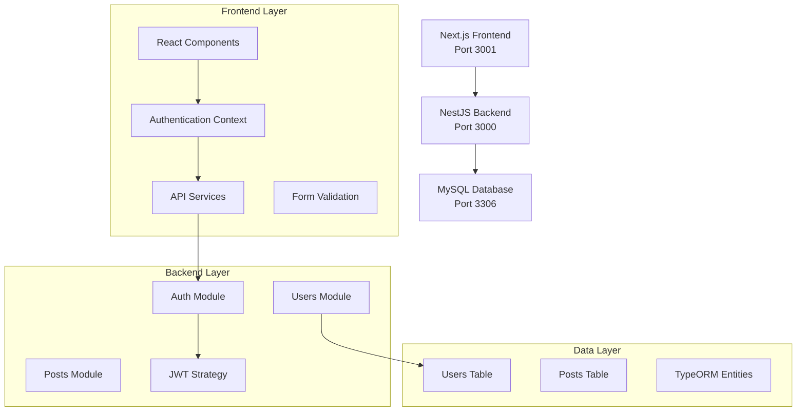

# 📝 Blog Authentication System

<div align="center">


</div>

> Hệ thống Blog với Authentication hoàn chỉnh sử dụng NestJS Backend và Next.js Frontend

## 📋 Mục lục

- [Tổng quan](#-tổng-quan)
- [Tính năng](#-tính-năng)
- [Kiến trúc hệ thống](#-kiến-trúc-hệ-thống)
- [Cài đặt nhanh](#-cài-đặt-nhanh)
- [API Documentation](#-api-documentation)
- [Frontend Features](#-frontend-features)
- [Bảo mật](#-bảo-mật)
- [Cấu trúc project](#-cấu-trúc-project)
- [Database Schema](#-database-schema)
- [Demo & Testing](#-demo--testing)
- [Troubleshooting](#-troubleshooting)
- [Đóng góp](#-đóng-góp)

## 🎯 Tổng quan

Blog Authentication System là một ứng dụng web hoàn chỉnh bao gồm:

- **Backend API** (NestJS): RESTful API với JWT authentication
- **Frontend Web** (Next.js): Giao diện người dùng responsive với TypeScript
- **Database** (MySQL): Lưu trữ dữ liệu user và posts
- **Security**: Mã hóa mật khẩu, JWT tokens, input validation

## ✨ Tính năng

### 🔐 Authentication

- ✅ User registration với validation mạnh mẽ
- ✅ JWT-based login/logout system
- ✅ Password hashing với bcrypt (12 rounds)
- ✅ Protected routes và middleware
- ✅ User profile management (GET/PUT)
- ✅ Role-based access control (admin, user, moderator)

### 🎨 Frontend Features

- ✅ Responsive design với Tailwind CSS
- ✅ Form validation với react-hook-form + yup
- ✅ Custom authentication hooks (useAuth)
- ✅ Layout components (Header, Sidebar, Footer)
- ✅ Error handling và loading states
- ✅ Cookie-based token management

### 🛠️ Technical Features

- ✅ TypeORM integration với MySQL
- ✅ Global validation pipes
- ✅ CORS configuration
- ✅ **Centralized Environment Management** 🔧
- ✅ RESTful API với versioning (/api/v1/)
- ✅ Comprehensive error handling

### 🔧 Environment Management

- ✅ **Centralized Configuration**: Tất cả env variables trong 1 file
- ✅ **Auto-generation**: Scripts tự động tạo env files cho backend/frontend
- ✅ **Cross-platform**: Node.js và PowerShell scripts
- ✅ **Security**: Template safe to commit, actual values protected
- ✅ **Developer Experience**: One command setup

## 🏗️ Kiến trúc hệ thống



## 🚀 Cài đặt nhanh

### Yêu cầu hệ thống

- Node.js 16+
- MySQL 8.0+
- npm hoặc yarn

### 1. Clone repository

```bash
git clone <repository-url>
cd Blog_Project
```

### 2. Setup Database

```sql
CREATE DATABASE blog_db;
```

### 3. Setup Environment (Centralized)

```bash
# Copy template environment file
cp .env.example .env

# Cập nhật thông tin thật trong .env
# DB_PASSWORD=your_mysql_password
# JWT_SECRET=your_jwt_secret_key
# NEXTAUTH_SECRET=your_nextauth_secret

# Tự động tạo env files cho backend/frontend
node setup-env.js
```

### 4. Setup Backend

```bash
cd blog-backend

# Cài đặt dependencies
npm install

# Environment đã được tạo từ bước 3
# Chạy backend
npm run start:dev
```

### 5. Setup Frontend (Terminal mới)

```bash
cd blog-frontend

# Cài đặt dependencies
npm install

# Environment đã được tạo từ bước 3
# Chạy frontend
npm run dev
```

### 6. Truy cập ứng dụng

- **Frontend**: http://localhost:3001
- **Backend API**: http://localhost:3000/api/v1
- **Health Check**: http://localhost:3000/api/v1/health

## 📚 API Documentation

### Authentication Endpoints

| Method | Endpoint                | Description      | Auth Required |
| ------ | ----------------------- | ---------------- | ------------- |
| POST   | `/api/v1/auth/register` | Đăng ký user mới | ❌            |
| POST   | `/api/v1/auth/login`    | Đăng nhập user   | ❌            |
| POST   | `/api/v1/auth/logout`   | Đăng xuất user   | ✅            |

### User Management

| Method | Endpoint                | Description           | Auth Required |
| ------ | ----------------------- | --------------------- | ------------- |
| GET    | `/api/v1/users/profile` | Lấy thông tin profile | ✅            |
| PUT    | `/api/v1/users/profile` | Cập nhật profile      | ✅            |

### Posts (Placeholder)

| Method | Endpoint                 | Description        | Auth Required |
| ------ | ------------------------ | ------------------ | ------------- |
| GET    | `/api/v1/posts`          | Lấy tất cả posts   | ❌            |
| GET    | `/api/v1/posts/my-posts` | Lấy posts của user | ✅            |

### Utility

| Method | Endpoint         | Description  | Auth Required |
| ------ | ---------------- | ------------ | ------------- |
| GET    | `/api/v1/health` | Health check | ❌            |

### Sample API Requests

#### Registration

```json
POST /api/v1/auth/register
{
  "email": "user@example.com",
  "password": "password123",
  "name": "John Doe",
  "bio": "Passionate blogger"
}
```

#### Login

```json
POST /api/v1/auth/login
{
  "email": "user@example.com",
  "password": "password123"
}
```

## 🎨 Frontend Features

### Pages

- **Homepage** (`/`): Landing page với overview
- **Registration** (`/register`): Form đăng ký với validation
- **Login** (`/login`): Form đăng nhập

### Components

- **Layout Components**: Header, Sidebar, Footer với responsive design
- **Form Components**: Registration/Login forms với validation
- **Authentication**: useAuth hook với context management

### Form Validation

```typescript
// Registration validation schema
const registrationSchema = yup.object({
  name: yup.string().required("Name is required").min(2),
  email: yup.string().required("Email is required").email(),
  password: yup.string().required("Password is required").min(6),
  confirmPassword: yup
    .string()
    .required("Confirm Password is required")
    .oneOf([yup.ref("password")], "Passwords must match"),
});
```

## 🔒 Bảo mật

### Password Security

- **Bcrypt hashing** với 12 salt rounds
- **Minimum password length**: 6 characters
- **Password confirmation** validation

### JWT Security

- **Token expiration**: 24 hours
- **Secure token storage**: HTTP-only cookies
- **Token refresh** mechanism (planned)

### Input Validation

- **Class-validator** decorators cho DTOs
- **Global validation pipe** với whitelist
- **XSS protection** với input sanitization

### API Security

- **CORS configuration** cho frontend integration
- **Rate limiting** (planned)
- **Request logging** (planned)

### Environment Security

- **Environment variables** cho sensitive data
- **Git ignore** cho .env files
- **Separate configs** cho development/production

## 📁 Cấu trúc project

```
Blog_Project/
├── 📁 blog-backend/          # NestJS Backend API
│   ├── 📁 src/
│   │   ├── 📁 auth/          # Authentication module
│   │   │   ├── auth.controller.ts
│   │   │   ├── auth.service.ts
│   │   │   ├── auth.module.ts
│   │   │   ├── jwt.strategy.ts
│   │   │   └── jwt-auth.guard.ts
│   │   ├── 📁 users/         # Users module
│   │   │   ├── users.controller.ts
│   │   │   ├── users.service.ts
│   │   │   └── users.module.ts
│   │   ├── 📁 posts/         # Posts module (placeholder)
│   │   ├── 📁 entities/      # Database entities
│   │   │   └── user.entity.ts
│   │   ├── 📁 dto/           # Data Transfer Objects
│   │   │   └── auth.dto.ts
│   │   ├── 📁 config/        # Configuration files
│   │   │   └── database.config.ts
│   │   ├── app.module.ts
│   │   └── main.ts
│   ├── .env.example          # Environment template
│   ├── package.json
│   └── README_BLOG.md
│
├── 📁 blog-frontend/         # Next.js Frontend
│   ├── 📁 src/
│   │   ├── 📁 app/           # Next.js 13+ app directory
│   │   │   ├── page.tsx      # Homepage
│   │   │   ├── layout.tsx    # Root layout
│   │   │   ├── login/
│   │   │   │   └── page.tsx  # Login page
│   │   │   └── register/
│   │   │       └── page.tsx  # Registration page
│   │   ├── 📁 components/    # React components
│   │   │   └── 📁 layout/    # Layout components
│   │   │       ├── Header.tsx
│   │   │       ├── Sidebar.tsx
│   │   │       ├── Footer.tsx
│   │   │       └── Layout.tsx
│   │   ├── 📁 hooks/         # Custom hooks
│   │   │   └── useAuth.tsx   # Authentication hook
│   │   ├── 📁 services/      # API services
│   │   │   └── api.ts        # API client
│   │   └── 📁 types/         # TypeScript types
│   ├── .env.example          # Environment template
│   ├── package.json
│   └── README.md
│
├── 📄 .gitignore             # Git ignore rules (centralized)
├── 📄 SECURITY.md            # Security guidelines
└── 📄 README.md              # This file
```

## 🗄️ Database Schema

### Users Table

```sql
CREATE TABLE users (
  id VARCHAR(36) PRIMARY KEY,              -- UUID
  email VARCHAR(255) UNIQUE NOT NULL,      -- Unique email
  password VARCHAR(255) NOT NULL,          -- Bcrypt hashed
  name VARCHAR(255) NOT NULL,              -- Display name
  avatar VARCHAR(255),                     -- Profile picture URL
  role ENUM('admin', 'user', 'moderator') DEFAULT 'user',
  bio VARCHAR(500),                        -- User biography
  created_at TIMESTAMP DEFAULT CURRENT_TIMESTAMP,
  updated_at TIMESTAMP DEFAULT CURRENT_TIMESTAMP ON UPDATE CURRENT_TIMESTAMP
);
```

### Posts Table (Planned)

```sql
CREATE TABLE posts (
  id VARCHAR(36) PRIMARY KEY,
  title VARCHAR(255) NOT NULL,
  content TEXT NOT NULL,
  author_id VARCHAR(36) NOT NULL,
  status ENUM('draft', 'published', 'archived') DEFAULT 'draft',
  created_at TIMESTAMP DEFAULT CURRENT_TIMESTAMP,
  updated_at TIMESTAMP DEFAULT CURRENT_TIMESTAMP ON UPDATE CURRENT_TIMESTAMP,
  FOREIGN KEY (author_id) REFERENCES users(id)
);
```

## 🧪 Demo & Testing

### Automated Testing

```bash
# Backend: Test tất cả API endpoints
cd blog-backend
node test-api.js
```

### Postman Collection

1. Import file: `blog-backend/Blog_API_Collection.postman_collection.json`
2. Set environment variable: `base_url = http://localhost:3000`
3. Run collection để test tất cả endpoints

### Manual Testing Flow

1. **Start services**: Backend (3000) + Frontend (3001)
2. **Register**: Tạo tài khoản mới tại `/register`
3. **Login**: Đăng nhập tại `/login`
4. **Profile**: Kiểm tra/cập nhật profile
5. **API Testing**: Sử dụng Postman collection

### Demo Script

Xem chi tiết trong file `blog-backend/DEMO_SCRIPT.md` để có demo flow hoàn chỉnh (5-10 phút).

## 🔧 Troubleshooting

### Common Issues

#### Database Connection Error

```
Error: Access denied for user 'root'@'localhost'
```

**Solution**: Cập nhật `DB_PASSWORD` trong file `.env`

#### Port Already in Use

```
Error: listen EADDRINUSE :::3000
```

**Solutions**:

- Backend: Đổi `PORT=3001` trong `.env`
- Frontend: `npm run dev -- -p 3002`
- Kill process: `lsof -ti:3000 | xargs kill -9` (Mac/Linux)

#### JWT Token Issues

```
Error: Unauthorized
```

**Solutions**:

- Kiểm tra `JWT_SECRET` trong `.env`
- Token có thể expired, login lại
- Đảm bảo token được gửi trong header

#### Module Not Found (Frontend)

```
Cannot find module '@/hooks/useAuth'
```

**Solution**: Kiểm tra `tsconfig.json` có paths mapping đúng

#### CORS Issues

```
Access to fetch blocked by CORS policy
```

**Solution**: Đảm bảo `FRONTEND_URL` trong backend `.env` đúng

### Debug Steps

1. ✅ MySQL server đang chạy?
2. ✅ Ports 3000, 3001 available?
3. ✅ File `.env` configured đúng?
4. ✅ Dependencies đã install?
5. ✅ Check terminal logs cho error details

### Environment Checklist

```bash
# Backend requirements
✅ Node.js 16+
✅ MySQL 8.0+
✅ .env file with DB credentials
✅ Port 3000 available

# Frontend requirements
✅ Node.js 16+
✅ .env.local with API URL
✅ Port 3001 available
✅ Backend running on 3000
```

## 🚀 Roadmap

### Phase 1 - COMPLETED ✅

- [x] User Registration/Login system
- [x] JWT Authentication
- [x] Basic user profile management
- [x] Frontend layout components
- [x] API integration

### Phase 2 - IN PROGRESS 🚧

- [ ] Posts CRUD operations
- [ ] Rich text editor for posts
- [ ] File upload for avatars
- [ ] Email verification
- [ ] Password reset functionality

### Phase 3 - PLANNED 📋

- [ ] Comments system
- [ ] User roles và permissions
- [ ] Search và filtering
- [ ] Social features (follow/unfollow)
- [ ] Real-time notifications

### Phase 4 - FUTURE 🔮

- [ ] Social media login (Google, Facebook)
- [ ] Two-factor authentication
- [ ] Admin dashboard
- [ ] Analytics và reporting
- [ ] Mobile app (React Native)

## 🤝 Đóng góp

### Development Workflow

1. Fork the project
2. Create feature branch (`git checkout -b feature/AmazingFeature`)
3. Commit changes (`git commit -m 'Add AmazingFeature'`)
4. Push to branch (`git push origin feature/AmazingFeature`)
5. Open Pull Request

### Code Standards

- **TypeScript**: Strict mode enabled
- **ESLint**: Airbnb configuration
- **Prettier**: Code formatting
- **Conventional Commits**: Commit message format

### Testing Requirements

- Unit tests cho services
- Integration tests cho controllers
- E2E tests cho critical flows
- Minimum 80% coverage

## 📄 License

This project is licensed under the MIT License - see the [LICENSE](LICENSE) file for details.

## 📞 Support

- **Documentation**: Check README files trong từng module
- **Issues**: Create GitHub issue với detailed description
- **Security**: Report security issues privately
- **Discussions**: Sử dụng GitHub Discussions cho questions

---

<div align="center">

**Made with ❤️ by Development Team**

[⬆ Về đầu trang](#-blog-authentication-system)

</div>
