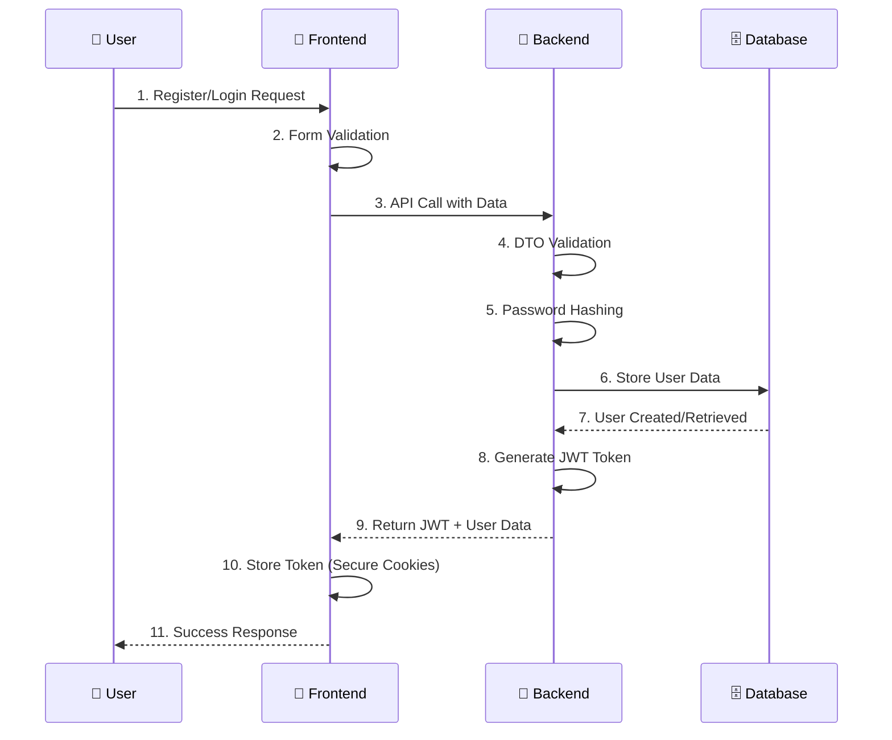

# 🚀 Blog Authentication System

<div align="center">


**🌟 Enterprise-Grade Authentication Platform**

*Secure • Scalable • Developer-Friendly*

[🚀 Quick Start](#-quick-start) • [📚 Documentation](#-documentation-hub) • [🎮 Live Demo](#-demo--testing) • [🤝 Contributing](#-contributing--community)

</div>

---

## 📋 Table of Contents

<details>
<summary><strong>Click to expand navigation</strong></summary>

- [🎯 Project Overview](#-project-overview)
- [✨ Key Features](#-key-features)
- [🚀 Quick Start](#-quick-start)
- [🏗️ System Architecture](#-system-architecture)
- [📚 Documentation Hub](#-documentation-hub)
- [🔧 Environment Management](#-environment-management)
- [📊 API Reference](#-api-reference)
- [🧪 Demo & Testing](#-demo--testing)
- [🚨 Troubleshooting](#-troubleshooting--support)
- [🎯 Roadmap](#-roadmap--future-development)
- [🤝 Contributing](#-contributing--community)
- [📄 License](#-license--credits)

</details>

---

## 🎯 Project Overview

> **Blog Authentication System** is a production-ready, enterprise-grade authentication platform built with modern web technologies and industry best practices.

### 🏆 **What Makes This Special?**

<table>
<tr>
<td width="50%">

**🔧 Backend Excellence**
- **NestJS** - Enterprise Node.js framework
- **TypeORM** - Type-safe database operations
- **MySQL** - Reliable relational database
- **JWT** - Stateless authentication

</td>
<td width="50%">

**🎨 Frontend Innovation**
- **Next.js 13+** - App Router & RSC
- **TypeScript** - Type safety everywhere
- **Tailwind CSS** - Utility-first styling
- **React Hook Form** - Performant forms

</td>
</tr>
</table>

### 📊 **Project Status**

| Aspect | Status | Description |
|--------|---------|-------------|
| **🔐 Authentication** | ✅ Complete | Registration, Login, JWT, Profile Management |
| **📚 Documentation** | ✅ Complete | Comprehensive guides for all scenarios |
| **🔧 DevOps** | ✅ Complete | Environment management, automation scripts |
| **🧪 Testing** | ✅ Complete | API testing, demo scripts, manual flows |
| **📝 Content System** | 🚧 In Progress | Blog posts, rich editor, file uploads |
| **👥 Social Features** | 📋 Planned | Comments, follows, notifications |

---

## ✨ Key Features

### 🔐 **Security First**

<div align="center">
<table>
<tr>
<td width="33%" align="center">

**🛡️ Authentication**
- JWT-based stateless auth
- Bcrypt password hashing (12 rounds)
- Secure cookie management
- Role-based access control

</td>
<td width="33%" align="center">

**🔒 Input Protection**
- Class-validator DTOs
- XSS prevention
- SQL injection protection
- CORS configuration

</td>
<td width="33%" align="center">

**⚙️ Environment Security**
- Centralized config management
- Secret auto-generation
- Git-safe templates
- Production-ready setup

</td>
</tr>
</table>
</div>

### 🎨 **Developer Experience**

- **⚡ One-Command Setup** - Get running in 5 minutes
- **📚 Comprehensive Docs** - 8 detailed guides covering everything
- **🔧 Auto-Generation** - Environment files, JWT secrets, configurations
- **🧪 Testing Suite** - Automated API tests, demo scripts, Postman collections
- **🔄 Hot Reload** - Instant feedback during development

### 🏗️ **Architecture Highlights**

- **🎯 Modular Design** - Clean separation of concerns
- **📱 Responsive UI** - Mobile-first Tailwind CSS design
- **🔄 Real-time Ready** - Prepared for WebSocket integration
- **📊 Type Safety** - End-to-end TypeScript coverage
- **🚀 Scalable** - Built for production deployment

---

## 🚀 Quick Start

### **📋 Prerequisites**

<table>
<tr>
<td width="50%">

**💻 System Requirements**
- **OS**: Windows 10+, macOS 10.15+, Ubuntu 18.04+
- **RAM**: 4GB minimum, 8GB recommended
- **Storage**: 2GB free space

</td>
<td width="50%">

**🛠️ Software Dependencies**
- **[Node.js](https://nodejs.org/)** 16+ (LTS recommended)
- **[MySQL](https://dev.mysql.com/downloads/)** 8.0+
- **[Git](https://git-scm.com/)** Latest version

</td>
</tr>
</table>

### **⚡ 5-Minute Setup**

```bash
# 🚀 Step 1: Clone & Navigate
git clone <your-repo-url>
cd Blog_Project

# 🔧 Step 2: Environment Setup
cp .env.example .env          # Copy template
# ✏️ Edit .env with your database credentials

# 🔐 Step 3: Generate Secure JWT Secret
node New-JwtSecret.js         # Auto-generates cryptographic secret
node setup-env.js             # Creates backend/frontend env files

# 🗄️ Step 4: Database Setup
mysql -u root -p
> CREATE DATABASE blog_db;
> EXIT;

# 🖥️ Step 5: Start Backend (Terminal 1)
cd blog-backend
npm install && npm run start:dev

# 🎨 Step 6: Start Frontend (Terminal 2)
cd blog-frontend  
npm install && npm run dev
```

### **🎉 Success! Your app is running:**

<div align="center">

| Service | URL | Status |
|---------|-----|--------|
| 🎨 **Frontend** | http://localhost:3001 | User Interface |
| 🖥️ **Backend API** | http://localhost:3000 | REST API |
| ❤️ **Health Check** | http://localhost:3000/api/v1/health | System Status |

</div>

> 💡 **Need detailed setup?** → [📖 Complete Setup Guide](docs/SETUP_COMPLETE.md)

---

## 🏗️ System Architecture

### **🎯 Technology Stack Overview**


### **🔄 Authentication Flow**



### **📁 Project Structure**

```
📁 Blog_Project/                 # 🏠 Root Directory
├── 📄 README.md                # 📖 Main Documentation
├── 📄 SECURITY.md              # 🔐 Security Guidelines
├── 📁 docs/                    # 📚 Detailed Documentation
│   ├── SETUP_COMPLETE.md       # 🚀 Complete Setup Guide
│   ├── BACKEND_DETAILS.md      # 🏗️ Backend Architecture
│   └── ENVIRONMENT_SETUP.md    # ⚙️ Environment Management
├── ⚙️ Environment Management   # 🔧 Configuration System
│   ├── .env.example            # 📋 Safe Template
│   ├── setup-env.js           # 🔄 Auto-generation (Node.js)
│   ├── setup-env.ps1          # 🔄 Auto-generation (PowerShell)
│   ├── New-JwtSecret.js        # 🔐 JWT Generator (Node.js)
│   └── New-JwtSecret.ps1       # 🔐 JWT Generator (PowerShell)
├── 📁 blog-backend/            # 🖥️ NestJS API Server
│   ├── 📁 src/auth/            # 🔐 Authentication Module
│   ├── 📁 src/users/           # 👥 User Management
│   └── 📁 src/config/          # ⚙️ App Configuration
└── 📁 blog-frontend/           # 🎨 Next.js Web Application
    ├── 📁 src/app/             # 📱 App Router Pages
    ├── 📁 src/components/      # ⚛️ React Components
    └── 📁 src/hooks/           # 🎣 Custom Hooks (useAuth)
```

---

## 📚 Documentation Hub

> Our documentation follows a **scientific, hierarchical approach** designed for different user types and scenarios.

### 🎯 **Documentation Philosophy**

<div align="center">
<table>
<tr>
<td width="33%" align="center">

**👥 Audience-Specific**
Documents target specific user roles and expertise levels

</td>
<td width="33%" align="center">

**📋 Purpose-Driven**
Organized by user intent and goals, not just features

</td>
<td width="33%" align="center">

**🔗 Cross-Referenced**
Logical flow between documents with clear navigation

</td>
</tr>
</table>
</div>

### 📖 **Documentation Levels**

#### **📚 Level 1: Overview & Quick Access**
| Document | Target Audience | When to Use |
|----------|----------------|-------------|
| **[📖 README.md](README.md)** | All users, first-time visitors | Project introduction, quick start |
| **[🔐 SECURITY.md](SECURITY.md)** | Developers, security auditors | Security review, audit preparation |

#### **📋 Level 2: Detailed Implementation**
| Document | Target Audience | When to Use |
|----------|----------------|-------------|
| **[🚀 Complete Setup Guide](docs/SETUP_COMPLETE.md)** | New developers, deployment teams | Fresh installation, production deployment |
| **[⚙️ Environment Setup](docs/ENVIRONMENT_SETUP.md)** | DevOps, configuration management | Environment configuration, CI/CD |
| **[🏗️ Backend Architecture](docs/BACKEND_DETAILS.md)** | Backend developers | API development, architecture understanding |

#### **🧪 Level 3: Operational Guides**
| Document | Target Audience | When to Use |
|----------|----------------|-------------|
| **[🎮 Demo Script](docs/DEMO_SCRIPT.md)** | Sales, QA, presentations | Feature demonstrations, testing |
| **[🚀 Runtime Guide](docs/HOW_TO_RUN.md)** | Operations, CI/CD | Production deployment, automation |
| **[📋 Setup Status](docs/SETUP_GUIDE.md)** | Project managers, QA | Progress tracking, feature validation |

### 🗺️ **Smart Navigation**

<details>
<summary><strong>🔍 What do you need help with?</strong></summary>

- **🚀 I'm new here** → [📖 README.md](README.md) → [🚀 Quick Start](#-quick-start)
- **⚙️ Environment setup** → [⚙️ Environment Setup](docs/ENVIRONMENT_SETUP.md)
- **🏗️ Backend development** → [🏗️ Backend Architecture](docs/BACKEND_DETAILS.md)
- **🎮 Demo/presentation** → [🎮 Demo Script](docs/DEMO_SCRIPT.md)
- **🚀 Production deployment** → [🚀 Complete Setup Guide](docs/SETUP_COMPLETE.md)
- **🔧 Something's broken** → [🚨 Troubleshooting](#-troubleshooting--support)

</details>

---

## 🔧 Environment Management

### **🎯 Philosophy: "Single Source of Truth"**

Our environment management eliminates configuration chaos through centralized, automated setup:

```bash
📄 .env.example          # 📋 Template (Safe to commit)
    ↓ [Copy & Edit]
📄 .env                  # 🔐 Main config (Private)
    ↓ [Auto-generate]
📄 blog-backend/.env     # 🖥️ Backend config
📄 blog-frontend/.env.local  # 🎨 Frontend config
```

### **⚡ One-Command Environment Setup**

<table>
<tr>
<td width="50%">

**🖥️ Cross-Platform Support**

```bash
# 🔄 Universal (Node.js)
node New-JwtSecret.js
node setup-env.js

# 🪟 Windows (PowerShell)
.\New-JwtSecret.ps1
.\setup-env.ps1
```

</td>
<td width="50%">

**🔐 Security Features**

- ✅ Cryptographic JWT secret generation
- ✅ Git-safe templates (no real secrets)
- ✅ Automatic variable mapping
- ✅ Cross-platform compatibility

</td>
</tr>
</table>

### **🔄 Automated Workflow**

1. **📋 Create Main Config**: `cp .env.example .env` → Edit with real values
2. **🔐 Generate Secrets**: `node New-JwtSecret.js` → Cryptographic JWT_SECRET  
3. **🔄 Auto-Generate**: `node setup-env.js` → Creates all sub-environment files
4. **✅ Verify Setup**: Both backend and frontend environment files ready

> **📖 Detailed Guide**: [Environment Setup Documentation](docs/ENVIRONMENT_SETUP.md)

---

## 📊 API Reference

### **🔐 Authentication Endpoints**

<div align="center">
<table>
<tr>
<th>Method</th>
<th>Endpoint</th>
<th>Description</th>
<th>Auth Required</th>
</tr>
<tr>
<td><code>POST</code></td>
<td><code>/api/v1/auth/register</code></td>
<td>User registration with validation</td>
<td>❌</td>
</tr>
<tr>
<td><code>POST</code></td>
<td><code>/api/v1/auth/login</code></td>
<td>User authentication & JWT issuance</td>
<td>❌</td>
</tr>
<tr>
<td><code>POST</code></td>
<td><code>/api/v1/auth/logout</code></td>
<td>User session termination</td>
<td>🔒 JWT</td>
</tr>
</table>
</div>

### **👥 User Management**

<div align="center">
<table>
<tr>
<th>Method</th>
<th>Endpoint</th>
<th>Description</th>
<th>Auth Required</th>
</tr>
<tr>
<td><code>GET</code></td>
<td><code>/api/v1/users/profile</code></td>
<td>Retrieve authenticated user profile</td>
<td>🔒 JWT</td>
</tr>
<tr>
<td><code>PUT</code></td>
<td><code>/api/v1/users/profile</code></td>
<td>Update user profile information</td>
<td>🔒 JWT</td>
</tr>
</table>
</div>

### **🔗 Usage Examples**

<details>
<summary><strong>📝 Registration Example</strong></summary>

```typescript
const registerUser = async (userData) => {
  const response = await fetch('/api/v1/auth/register', {
    method: 'POST',
    headers: {
      'Content-Type': 'application/json',
    },
    body: JSON.stringify({
      email: 'user@example.com',
      password: 'securePassword123',
      name: 'John Doe',
      bio: 'Full-stack developer'
    })
  });
  
  return response.json();
};
```

</details>

<details>
<summary><strong>🔐 Authentication Example</strong></summary>

```typescript
const loginUser = async (credentials) => {
  const response = await fetch('/api/v1/auth/login', {
    method: 'POST',
    credentials: 'include', // Important for cookies
    headers: {
      'Content-Type': 'application/json',
    },
    body: JSON.stringify(credentials)
  });
  
  return response.json();
};
```

</details>

<details>
<summary><strong>🛡️ Protected Route Example</strong></summary>

```typescript
const getUserProfile = async () => {
  const response = await fetch('/api/v1/users/profile', {
    method: 'GET',
    credentials: 'include', // JWT from secure cookies
  });
  
  return response.json();
};
```

</details>

> **📖 Complete API Documentation**: [Backend Architecture Guide](docs/BACKEND_DETAILS.md)

---

## 🧪 Demo & Testing

### **🎮 Interactive Demo Flow**

<div align="center">
<table>
<tr>
<td width="33%" align="center">

**1️⃣ Registration**
- Navigate to `/register`
- Test form validation
- Create new account
- Verify success flow

</td>
<td width="33%" align="center">

**2️⃣ Authentication**
- Navigate to `/login`
- Test credentials
- Verify JWT cookies
- Check dashboard access

</td>
<td width="33%" align="center">

**3️⃣ Profile Management**
- View user information
- Update profile data
- Test protected routes
- Verify persistence

</td>
</tr>
</table>
</div>

### **🧪 Automated Testing Suite**

```bash
# 🖥️ Backend API Testing
cd blog-backend
node test-api.js
# → Tests all endpoints automatically
# → Validates authentication flow
# → Checks error handling

# 📮 Postman Collection Testing
# 1. Import: Blog_API_Collection.postman_collection.json
# 2. Set environment: base_url = http://localhost:3000
# 3. Run collection → All tests should pass ✅
```

### **📊 Test Coverage**

| Test Type | Coverage | Description |
|-----------|----------|-------------|
| **🔐 Authentication** | ✅ Complete | Registration, login, logout, JWT validation |
| **👥 User Management** | ✅ Complete | Profile CRUD, validation, error handling |
| **🛡️ Security** | ✅ Complete | Input validation, XSS prevention, auth guards |
| **🗄️ Database** | ✅ Complete | Entity relationships, migrations, constraints |
| **🎨 Frontend** | ✅ Complete | Form validation, state management, routing |

> **📖 Detailed Testing Guide**: [Demo Script Documentation](docs/DEMO_SCRIPT.md)

---

## 🚨 Troubleshooting & Support

### **🔧 Common Issues & Quick Fixes**

<details>
<summary><strong>🗄️ Database Connection Failed</strong></summary>

```bash
❌ Error: Access denied for user 'root'@'localhost'

🔧 Solutions:
1. Check MySQL service: net start mysql (Windows)
2. Verify credentials in .env file
3. Test connection: mysql -u root -p
4. Create dedicated user:
   CREATE USER 'blog_user'@'localhost' IDENTIFIED BY 'secure_password';
   GRANT ALL PRIVILEGES ON blog_db.* TO 'blog_user'@'localhost';
   FLUSH PRIVILEGES;
```

</details>

<details>
<summary><strong>🔌 Port Already in Use</strong></summary>

```bash
❌ Error: listen EADDRINUSE :::3000

🔧 Solutions:
1. Kill existing process:
   # Windows: netstat -ano | findstr :3000
   # Mac/Linux: lsof -ti:3000 | xargs kill -9
2. Change port in .env: PORT=3001
3. Use different port: npm run dev -- -p 3002
```

</details>

<details>
<summary><strong>🔐 JWT Secret Issues</strong></summary>

```bash
❌ Error: JWT_SECRET is not defined

🔧 Solutions:
1. Regenerate JWT secret: node New-JwtSecret.js
2. Recreate env files: node setup-env.js
3. Verify files exist: ls blog-backend/.env blog-frontend/.env.local
4. Restart both servers
```

</details>

### **🚀 Emergency Reset Commands**

```bash
# 🔄 Complete System Reset
pkill -f node                           # Kill all Node processes
node setup-env.js                       # Regenerate environment files
cd blog-backend && npm run start:dev    # Restart backend
cd blog-frontend && npm run dev         # Restart frontend
```

### **📞 Getting Help**

<div align="center">
<table>
<tr>
<td width="25%" align="center">

**📚 Documentation**
Check [docs/](docs/) for detailed guides

</td>
<td width="25%" align="center">

**🐛 Bug Reports**
GitHub Issues with details

</td>
<td width="25%" align="center">

**💬 Discussions** 
GitHub Discussions for Q&A

</td>
<td width="25%" align="center">

**🔐 Security**
Private security reports

</td>
</tr>
</table>
</div>

---

## 🎯 Roadmap & Future Development

### **📈 Development Phases**

<div align="center">
<table>
<tr>
<th>Phase</th>
<th>Status</th>
<th>Features</th>
<th>Timeline</th>
</tr>
<tr>
<td><strong>Phase 1</strong><br/>Foundation</td>
<td>✅ Complete</td>
<td>Authentication, Documentation, DevOps</td>
<td>Q3 2025</td>
</tr>
<tr>
<td><strong>Phase 2</strong><br/>Content System</td>
<td>🚧 In Progress</td>
<td>Blog CRUD, Rich Editor, File Upload</td>
<td>Q4 2025</td>
</tr>
<tr>
<td><strong>Phase 3</strong><br/>Social Features</td>
<td>📋 Planned</td>
<td>Comments, Follows, Notifications</td>
<td>Q1 2026</td>
</tr>
<tr>
<td><strong>Phase 4</strong><br/>Enterprise</td>
<td>🔮 Future</td>
<td>Admin Panel, Analytics, Mobile App</td>
<td>Q2 2026</td>
</tr>
</table>
</div>

### **🚧 Phase 2: Content Management** (In Progress)

- [ ] **📝 Blog Post CRUD** - Create, read, update, delete posts
- [ ] **✏️ Rich Text Editor** - WYSIWYG editor with markdown support
- [ ] **📁 File Upload System** - Images, avatars, attachments
- [ ] **🏷️ Categories & Tags** - Content organization and filtering
- [ ] **🔍 Search Functionality** - Full-text search across posts

### **📈 Phase 3: Social Features** (Planned)

- [ ] **💬 Comments System** - Threaded comments with moderation
- [ ] **👥 User Interactions** - Follow/unfollow, user profiles
- [ ] **🔔 Real-time Notifications** - WebSocket-based updates
- [ ] **📱 Social Login** - Google, GitHub, Facebook integration
- [ ] **⭐ Reactions & Likes** - Post engagement features

### **🔮 Phase 4: Enterprise Features** (Future)

- [ ] **👨‍💼 Admin Dashboard** - User management, analytics, moderation
- [ ] **📊 Analytics & Reporting** - Usage statistics, performance metrics
- [ ] **🔐 Two-Factor Authentication** - Enhanced security with TOTP
- [ ] **📱 Mobile Application** - React Native iOS/Android app
- [ ] **🏗️ Microservices Migration** - Scalable architecture evolution

---

## 🤝 Contributing & Community

### **🔧 Development Workflow**

<div align="center">
<table>
<tr>
<td width="20%" align="center">

**1️⃣ Fork**
Fork the repository

</td>
<td width="20%" align="center">

**2️⃣ Branch**
Create feature branch

</td>
<td width="20%" align="center">

**3️⃣ Code**
Follow standards

</td>
<td width="20%" align="center">

**4️⃣ Test**
Add tests & docs

</td>
<td width="20%" align="center">

**5️⃣ PR**
Submit pull request

</td>
</tr>
</table>
</div>

### **📝 Code Standards**

| Aspect | Standard | Tools |
|--------|----------|-------|
| **🔤 Language** | TypeScript Strict Mode | TSC, ESLint |
| **🎨 Formatting** | Prettier Configuration | Prettier, EditorConfig |
| **📏 Linting** | Airbnb Style Guide | ESLint, Custom Rules |
| **🧪 Testing** | 80% Coverage Minimum | Jest, Supertest |
| **📚 Documentation** | Comprehensive Updates | Markdown, Mermaid |

### **👥 Community Guidelines**

<details>
<summary><strong>🤝 How to Contribute</strong></summary>

1. **🍴 Fork the repository** and clone locally
2. **🌿 Create a feature branch**: `git checkout -b feature/amazing-feature`
3. **💻 Write clean, tested code** following our standards
4. **📚 Update documentation** for any new features
5. **🧪 Ensure all tests pass** and coverage requirements met
6. **📝 Write clear commit messages** using conventional commits
7. **🔄 Submit a pull request** with detailed description

</details>

<details>
<summary><strong>🐛 Reporting Issues</strong></summary>

When reporting bugs, please include:
- **🖥️ Environment details** (OS, Node.js version, etc.)
- **📝 Steps to reproduce** the issue
- **📷 Screenshots or logs** if applicable
- **🎯 Expected vs actual behavior**
- **🔧 Attempted solutions** you've tried

</details>

<details>
<summary><strong>💡 Suggesting Features</strong></summary>

For feature requests:
- **📋 Clear description** of the proposed feature
- **🎯 Use case and benefits** explanation
- **🏗️ Implementation considerations** if any
- **📊 Impact assessment** on existing features

</details>

### **🏆 Contributors**

<div align="center">

**Special thanks to all contributors who make this project better! 🙏**

*Become a contributor and see your name here!*

</div>

---

## 📄 License & Credits

### **📋 License**

This project is licensed under the **MIT License** - see the [LICENSE](LICENSE) file for details.

### **🙏 Acknowledgments**

<div align="center">
<table>
<tr>
<td width="25%" align="center">

**🏗️ NestJS Team**
Enterprise Node.js framework

</td>
<td width="25%" align="center">

**⚛️ Vercel Team**
Next.js React framework

</td>
<td width="25%" align="center">

**🗄️ TypeORM Team**
TypeScript ORM

</td>
<td width="25%" align="center">

**🎨 Tailwind CSS**
Utility-first CSS

</td>
</tr>
</table>
</div>

### **🌟 Inspiration**

- **Open Source Community** - For continuous inspiration and best practices
- **Security Researchers** - For highlighting authentication vulnerabilities  
- **Developer Community** - For feedback and feature suggestions
- **Modern Web Standards** - For pushing the boundaries of web development

---

<div align="center">

## 🎉 Ready to Build Something Amazing?

**Choose your path to get started:**

<table>
<tr>
<td width="25%" align="center">

[🚀 **Quick Start**](#-quick-start)
*5-minute setup*

</td>
<td width="25%" align="center">

[📖 **Complete Guide**](docs/SETUP_COMPLETE.md)
*Detailed setup*

</td>
<td width="25%" align="center">

[🎮 **Live Demo**](docs/DEMO_SCRIPT.md)
*Try features*

</td>
<td width="25%" align="center">

[🤝 **Contribute**](#-contributing--community)
*Join the project*

</td>
</tr>
</table>

---

**🎨 Made with ❤️ and modern web technologies**

**⚡ Powered by NestJS • Next.js • TypeScript • MySQL**

<sub>Last updated: September 29, 2025 | Version 1.0.0</sub>

[⬆ Back to Top](#-blog-authentication-system)

</div>