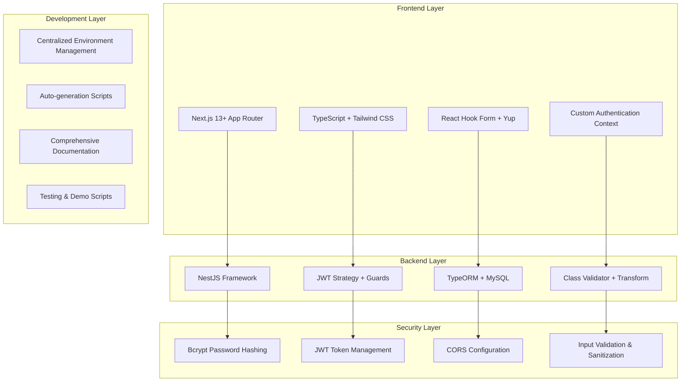
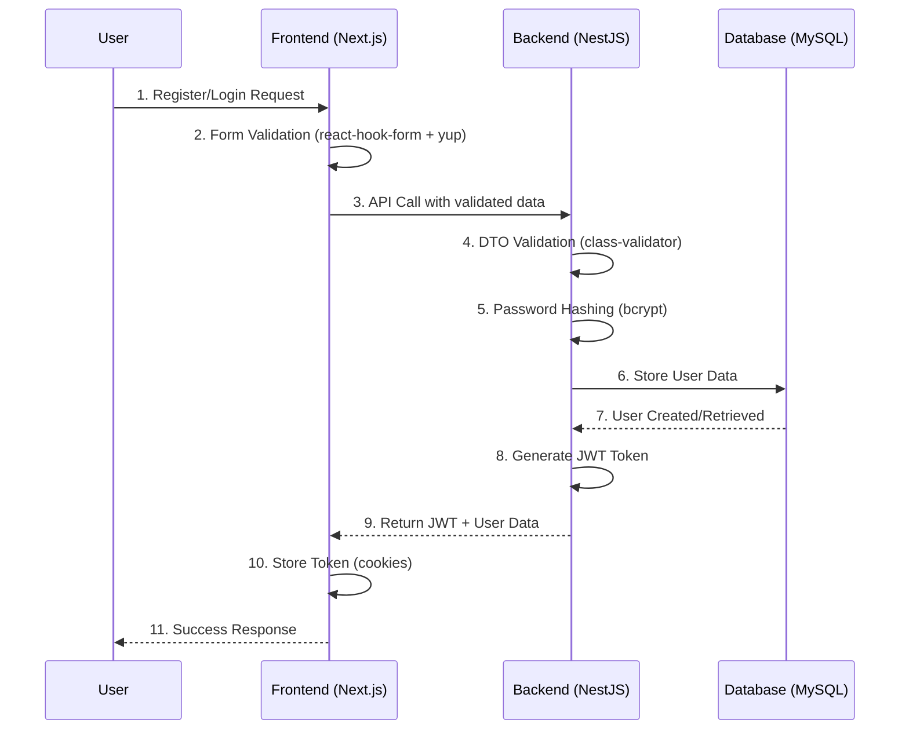

# 📝 Blog Authentication System

<div align="center">


**Enterprise-Grade Authentication System với NestJS & Next.js**

[🚀 Quick Start](#-quick-start) • [📖 Documentation](#-documentation-system) • [🧪 Demo](#-demo--testing) • [📞 Support](#-support)

</div>

---

## 🎯 Project Overview

**Blog Authentication System** là một enterprise-grade authentication solution được xây dựng với:

- **🔧 Backend**: NestJS + TypeORM + MySQL
- **🎨 Frontend**: Next.js + TypeScript + Tailwind CSS
- **🔐 Security**: JWT Authentication + Bcrypt + Input Validation
- **⚙️ DevOps**: Centralized Environment Management + Auto-generation Tools

### � **Project Status**

- ✅ **MVP Complete**: Authentication system fully functional
- 🚧 **In Progress**: Blog post management features
- 📋 **Planned**: Advanced features (comments, social, admin panel)

---

## 🚀 Quick Start

### **Prerequisites**

- Node.js 16+ • MySQL 8.0+ • Git

### **5-Minute Setup**

```bash
# 1. Clone & Setup
git clone <your-repo-url>
cd Blog_Project
cp .env.example .env  # Edit với thông tin thật

# 2. Generate Secure Environment
node generate-jwt-secret.js  # Auto-generate JWT_SECRET
node setup-env.js           # Create backend/frontend env files

# 3. Database Setup
mysql -u root -p
CREATE DATABASE blog_db;

# 4. Start Backend
cd blog-backend && npm install && npm run start:dev

# 5. Start Frontend (new terminal)
cd blog-frontend && npm install && npm run dev
```

**🎉 Done!** Access http://localhost:3001

> **Need detailed setup?** → [📖 Complete Setup Guide](docs/SETUP_COMPLETE.md)

---

## 📖 Documentation System

Our documentation follows a **hierarchical, purpose-driven structure**:

### 📚 **Level 1: Overview & Quick Access**

| Document                       | Purpose                                     | Target Audience                |
| ------------------------------ | ------------------------------------------- | ------------------------------ |
| **[README.md](README.md)**     | Project overview, quick start, architecture | All users, first-time visitors |
| **[SECURITY.md](SECURITY.md)** | Security guidelines, best practices         | Developers, security auditors  |

### 📋 **Level 2: Detailed Guides**

| Document                                               | Purpose                             | Target Audience                  |
| ------------------------------------------------------ | ----------------------------------- | -------------------------------- |
| **[📖 Complete Setup Guide](docs/SETUP_COMPLETE.md)**  | Step-by-step setup từ A-Z           | New developers, deployment teams |
| **[⚙️ Environment Setup](docs/ENVIRONMENT_SETUP.md)**  | Environment management system       | DevOps, configuration management |
| **[🏗️ Backend Architecture](docs/BACKEND_DETAILS.md)** | API architecture, modules, database | Backend developers               |

### 🧪 **Level 3: Operational Guides**

| Document                                  | Purpose                              | Target Audience       |
| ----------------------------------------- | ------------------------------------ | --------------------- |
| **[🎮 Demo Script](docs/DEMO_SCRIPT.md)** | 5-minute demo flow for presentations | Sales, demos, testing |
| **[🚀 How to Run](docs/HOW_TO_RUN.md)**   | Runtime commands, deployment         | Operations, CI/CD     |
| **[📋 Setup Guide](docs/SETUP_GUIDE.md)** | Feature checklist, project status    | Project managers, QA  |

### 🎯 **Documentation Navigation Logic:**

```
🔍 Need quick overview? → README.md (this file)
⚡ Want to start coding? → docs/SETUP_COMPLETE.md
🔧 Setting up env? → docs/ENVIRONMENT_SETUP.md
🏗️ Understanding backend? → docs/BACKEND_DETAILS.md
🎮 Need to demo? → docs/DEMO_SCRIPT.md
🚨 Troubleshooting? → Any file has troubleshooting section
```

---

## 🏗️ System Architecture

### **Technology Stack**



### **Data Flow Architecture**



### **Project Structure Logic**

```
📁 Blog_Project/                 ← Root (Git repository)
├── 📄 README.md                ← Main entry point (this file)
├── 📄 SECURITY.md              ← Security guidelines
├── 📁 docs/                    ← Detailed documentation
│   ├── SETUP_COMPLETE.md       ← Complete setup guide
│   ├── BACKEND_DETAILS.md      ← Backend architecture
│   └── ENVIRONMENT_SETUP.md    ← Environment management
├── ⚙️ Environment Management   ← Centralized configuration
│   ├── .env.example            ← Safe template
│   ├── setup-env.js/ps1        ← Auto-generation
│   └── generate-jwt-secret.js/ps1
├── 📁 blog-backend/            ← NestJS API Server
│   ├── 📁 src/auth/            ← Authentication module
│   ├── 📁 src/users/           ← User management
│   └── 📁 src/config/          ← App configuration
└── 📁 blog-frontend/           ← Next.js Web Application
    ├── 📁 src/app/             ← App Router pages
    ├── 📁 src/components/      ← React components
    └── 📁 src/hooks/           ← Custom hooks (useAuth)
```

---

## ✨ Core Features

### 🔐 **Authentication System**

- ✅ **Registration**: Email validation, password strength, duplicate prevention
- ✅ **Login**: JWT-based authentication with secure cookie storage
- ✅ **Profile Management**: View/update user information and avatar
- ✅ **Security**: Bcrypt hashing (12 rounds), XSS protection, CORS configuration
- ✅ **Authorization**: Role-based access control (admin/user/moderator)

### 🎨 **Frontend Experience**

- ✅ **Modern UI**: Responsive design with Tailwind CSS
- ✅ **Form Management**: react-hook-form + yup validation
- ✅ **State Management**: Custom useAuth hook with React Context
- ✅ **User Experience**: Loading states, error handling, success feedback
- ✅ **Navigation**: Protected routes, automatic redirects

### ⚙️ **Developer Experience**

- ✅ **Environment Management**: One-command setup with auto-generation
- ✅ **Documentation**: Hierarchical, purpose-driven documentation system
- ✅ **Testing**: Automated API testing scripts + manual test flows
- ✅ **Security**: JWT secret generation, environment protection
- ✅ **Development**: Hot reload, TypeScript support, comprehensive error handling

---

## 🧪 Demo & Testing

### **🎮 Quick Demo Flow**

```bash
# 1. Start both servers
cd blog-backend && npm run start:dev
cd blog-frontend && npm run dev  # New terminal

# 2. Test registration (http://localhost:3001/register)
Name: John Doe
Email: john@example.com
Password: password123
Bio: Full-stack developer

# 3. Test login (http://localhost:3001/login)
Email: john@example.com
Password: password123

# 4. Verify authentication
# → Should redirect to homepage with user info in sidebar
# → JWT token stored in secure cookies
# → Can access/update profile information
```

### **🧪 Automated Testing**

```bash
# Backend API testing
cd blog-backend
node test-api.js  # Tests all endpoints automatically

# Postman collection testing
# Import: Blog_API_Collection.postman_collection.json
# Set base_url = http://localhost:3000
# Run collection → All tests should pass
```

> **📖 Detailed Testing Guide**: [Demo Script](docs/DEMO_SCRIPT.md)

---

## 🔧 Environment Management System

### **🎯 Centralized Configuration Philosophy**

Our environment management follows **"Single Source of Truth"** principle:

```bash
📄 .env.example (Template - Safe to commit)
     ↓ [Copy & Edit]
📄 .env (Main config - Private)
     ↓ [Auto-generate via setup-env.js]
📄 blog-backend/.env (Backend config)
📄 blog-frontend/.env.local (Frontend config)
```

### **⚡ Auto-Generation Workflow**

```bash
# 1. Create your main environment file
cp .env.example .env
# Edit .env with your actual values

# 2. Generate secure JWT secret
node generate-jwt-secret.js
# → Updates .env with cryptographically secure JWT_SECRET

# 3. Auto-generate sub-environment files
node setup-env.js
# → Creates blog-backend/.env
# → Creates blog-frontend/.env.local
# → Maps variables correctly to each application

# 4. Verify setup
ls blog-backend/.env blog-frontend/.env.local
# Both files should exist and contain correct mappings
```

### **🔐 Security Features**

- ✅ **Template Safety**: .env.example contains no real secrets
- ✅ **Git Protection**: .gitignore prevents committing sensitive files
- ✅ **Cross-Platform**: Scripts work on Windows (PowerShell) and Unix (Node.js)
- ✅ **Validation**: Scripts verify required variables exist
- ✅ **Documentation**: Clear mapping of variables to applications

> **📖 Environment Details**: [Environment Setup Guide](docs/ENVIRONMENT_SETUP.md)

---

## 📊 API Reference

### **Authentication Endpoints**

| Method | Endpoint                | Description       | Body                            | Response        |
| ------ | ----------------------- | ----------------- | ------------------------------- | --------------- |
| `POST` | `/api/v1/auth/register` | User registration | `{email, password, name, bio?}` | `{user, token}` |
| `POST` | `/api/v1/auth/login`    | User login        | `{email, password}`             | `{user, token}` |
| `POST` | `/api/v1/auth/logout`   | User logout       | -                               | `{message}`     |

### **User Management**

| Method | Endpoint                | Description      | Auth   | Response |
| ------ | ----------------------- | ---------------- | ------ | -------- |
| `GET`  | `/api/v1/users/profile` | Get user profile | 🔒 JWT | `{user}` |
| `PUT`  | `/api/v1/users/profile` | Update profile   | 🔒 JWT | `{user}` |

### **System Endpoints**

| Method | Endpoint         | Description  | Response              |
| ------ | ---------------- | ------------ | --------------------- |
| `GET`  | `/api/v1/health` | Health check | `{status, timestamp}` |

### **🔗 API Usage Examples**

```typescript
// Registration
const response = await fetch("/api/v1/auth/register", {
  method: "POST",
  headers: { "Content-Type": "application/json" },
  body: JSON.stringify({
    email: "user@example.com",
    password: "securePassword123",
    name: "John Doe",
    bio: "Software Developer",
  }),
});

// Login with JWT storage
const loginResponse = await fetch("/api/v1/auth/login", {
  method: "POST",
  credentials: "include", // Important for cookies
  headers: { "Content-Type": "application/json" },
  body: JSON.stringify({
    email: "user@example.com",
    password: "securePassword123",
  }),
});

// Protected route access
const profileResponse = await fetch("/api/v1/users/profile", {
  credentials: "include", // JWT from cookies
});
```

> **📖 Complete API Docs**: [Backend Architecture](docs/BACKEND_DETAILS.md)

---

## 🚨 Troubleshooting & Support

### **🔧 Common Issues**

<details>
<summary><strong>Database Connection Failed</strong></summary>

```bash
Error: Access denied for user 'root'@'localhost'

# Solutions:
1. Check MySQL is running: net start mysql (Windows)
2. Verify credentials in .env file
3. Test connection: mysql -u root -p
4. Recreate user if needed:
   CREATE USER 'blog_user'@'localhost' IDENTIFIED BY 'password';
   GRANT ALL PRIVILEGES ON blog_db.* TO 'blog_user'@'localhost';
```

</details>

<details>
<summary><strong>Port Already in Use</strong></summary>

```bash
Error: listen EADDRINUSE :::3000

# Solutions:
1. Kill existing process: lsof -ti:3000 | xargs kill -9
2. Change port in .env: PORT=3001
3. Use different ports: npm run dev -- -p 3002
```

</details>

<details>
<summary><strong>Environment Variables Missing</strong></summary>

```bash
Error: JWT_SECRET is not defined

# Solutions:
1. Regenerate JWT secret: node generate-jwt-secret.js
2. Recreate env files: node setup-env.js
3. Verify files exist: ls blog-backend/.env
```

</details>

### **📞 Getting Help**

- **📚 Documentation**: Check [docs/](docs/) folder for detailed guides
- **🔍 Troubleshooting**: Each documentation file has troubleshooting section
- **🐛 Issues**: Create GitHub issue with error details and environment info
- **💬 Discussions**: Use GitHub Discussions for questions and best practices

### **🚀 Quick Reset Commands**

```bash
# Complete reset and restart
pkill -f node                    # Kill all Node processes
node setup-env.js               # Regenerate environment files
cd blog-backend && npm run start:dev    # Restart backend
cd blog-frontend && npm run dev         # Restart frontend (new terminal)
```

---

## 🎯 Roadmap & Future Development

### **📋 Current Status**

- ✅ **MVP Complete**: Full authentication system operational
- ✅ **Documentation**: Comprehensive, hierarchical documentation system
- ✅ **Developer Experience**: One-command setup and environment management
- ✅ **Security**: Industry-standard security practices implemented

### **🚧 Phase 2: Content Management** (In Progress)

- [ ] Blog post CRUD operations
- [ ] Rich text editor integration
- [ ] File upload for images and avatars
- [ ] Post categories and tags

### **📈 Phase 3: Social Features** (Planned)

- [ ] User-to-user interactions (follow/unfollow)
- [ ] Comments and reactions system
- [ ] Real-time notifications
- [ ] Social media login integration

### **🔮 Phase 4: Advanced Features** (Future)

- [ ] Admin dashboard with user management
- [ ] Analytics and reporting
- [ ] Two-factor authentication
- [ ] Mobile app (React Native)
- [ ] Microservices architecture migration

---

## 🤝 Contributing & Community

### **🔧 Development Workflow**

1. Fork the repository
2. Create feature branch: `git checkout -b feature/amazing-feature`
3. Follow code standards: TypeScript strict mode, ESLint, Prettier
4. Add tests for new features
5. Update documentation if needed
6. Submit Pull Request with detailed description

### **📝 Code Standards**

- **TypeScript**: Strict mode enabled with comprehensive type definitions
- **ESLint**: Airbnb configuration with custom rules
- **Prettier**: Consistent code formatting
- **Testing**: Minimum 80% coverage for new features
- **Documentation**: Update relevant docs for any changes

### **👥 Community**

- **Discussions**: GitHub Discussions for questions and ideas
- **Issues**: Bug reports and feature requests
- **Security**: Report security issues privately
- **Documentation**: Help improve and translate documentation

---

## 📄 License & Credits

### **📋 License**

This project is licensed under the **MIT License** - see the [LICENSE](LICENSE) file for details.

### **🙏 Acknowledgments**

- **NestJS Team** - Excellent Node.js framework
- **Vercel Team** - Amazing Next.js framework
- **TypeORM Team** - Powerful ORM for TypeScript
- **Tailwind CSS** - Utility-first CSS framework
- **Open Source Community** - For inspiration and best practices

---

<div align="center">

## 🎉 Ready to Get Started?

**Choose your path:**

[🚀 **Quick Start**](#-quick-start) • [📖 **Complete Setup Guide**](docs/SETUP_COMPLETE.md) • [🎮 **Demo Script**](docs/DEMO_SCRIPT.md)

**Made with ❤️ by DTA** • **Powered by NestJS + Next.js**

[⬆ Back to Top](#-blog-authentication-system)

</div>
