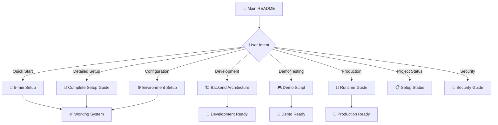

# 📚 Documentation Index - Blog Authentication System

<div align="center">

**Comprehensive Documentation System**  
_Navigate through our hierarchical, purpose-driven documentation_

[🏠 Main README](../README.md) • [🚀 Quick Start](../README.md#-quick-start) • [📞 Support](../README.md#-troubleshooting--support)

</div>

---

## 📖 Documentation Philosophy

Our documentation follows a **scientific, hierarchical approach** designed for different user types and use cases:

### **🎯 User-Centric Design**

- **👥 Audience-Specific**: Each document targets specific user roles
- **📋 Purpose-Driven**: Documents organized by user intent and goals
- **🔗 Cross-Referenced**: Logical flow between documents with clear navigation
- **🔍 Searchable**: Clear headings and structured content for easy searching

### **📊 Documentation Levels**

```
Level 1: Overview & Entry Points     → All Users
Level 2: Detailed Implementation     → Developers
Level 3: Operational & Maintenance   → DevOps/QA
```

---

## 📋 Complete Documentation Map

### **📚 Level 1: Overview & Quick Access**

| Document                                | Target Audience         | Purpose                                     | When to Use                        |
| --------------------------------------- | ----------------------- | ------------------------------------------- | ---------------------------------- |
| **[📝 Main README](../README.md)**      | All users, new visitors | Project overview, quick start, architecture | First visit, project introduction  |
| **[🔐 Security Guide](../SECURITY.md)** | Developers, auditors    | Security practices, guidelines              | Security review, audit preparation |

### **📋 Level 2: Detailed Implementation**

| Document                                          | Target Audience            | Purpose                             | When to Use                          |
| ------------------------------------------------- | -------------------------- | ----------------------------------- | ------------------------------------ |
| **[📖 Complete Setup Guide](SETUP_COMPLETE.md)**  | New developers, deployment | Step-by-step setup từ A-Z           | Fresh installation, deployment       |
| **[⚙️ Environment Setup](ENVIRONMENT_SETUP.md)**  | DevOps, configuration      | Environment management system       | Configuration management, CI/CD      |
| **[🏗️ Backend Architecture](BACKEND_DETAILS.md)** | Backend developers         | API architecture, modules, database | Backend development, API integration |

### **🧪 Level 3: Operational & Maintenance**

| Document                              | Target Audience      | Purpose                           | When to Use                       |
| ------------------------------------- | -------------------- | --------------------------------- | --------------------------------- |
| **[🎮 Demo Script](DEMO_SCRIPT.md)**  | Sales, QA, testing   | 5-minute demo flow                | Presentations, feature validation |
| **[🚀 Runtime Guide](HOW_TO_RUN.md)** | Operations, CI/CD    | Runtime commands, deployment      | Production deployment, automation |
| **[📋 Setup Status](SETUP_GUIDE.md)** | Project managers, QA | Feature checklist, project status | Project tracking, progress review |

---

## 🗺️ Navigation Guide

### **🔍 What Do You Need?**

<details>
<summary><strong>🚀 I'm new here - where do I start?</strong></summary>

**Start Here**: [📝 Main README](../README.md)

- Get project overview and architecture
- Follow the [🚀 Quick Start](../README.md#-quick-start) for 5-minute setup
- If you need detailed setup → [📖 Complete Setup Guide](SETUP_COMPLETE.md)

</details>

<details>
<summary><strong>⚙️ I need to configure the environment</strong></summary>

**Environment Management**: [⚙️ Environment Setup](ENVIRONMENT_SETUP.md)

- Centralized configuration system
- Auto-generation scripts
- Cross-platform setup (Windows/Unix)
- Security best practices

</details>

<details>
<summary><strong>🏗️ I'm working on the backend/API</strong></summary>

**Backend Development**: [🏗️ Backend Architecture](BACKEND_DETAILS.md)

- Module structure and design patterns
- API endpoints and authentication
- Database schema and relationships
- Testing and validation

</details>

<details>
<summary><strong>🎮 I need to demo this to someone</strong></summary>

**Demo & Presentation**: [🎮 Demo Script](DEMO_SCRIPT.md)

- 5-minute presentation flow
- Key features showcase
- Testing scenarios
- Live demo guidelines

</details>

<details>
<summary><strong>🚀 I'm deploying to production</strong></summary>

**Production Deployment**:

1. [📖 Complete Setup Guide](SETUP_COMPLETE.md) - Production section
2. [🚀 Runtime Guide](HOW_TO_RUN.md) - Deployment commands
3. [🔐 Security Guide](../SECURITY.md) - Production security

</details>

<details>
<summary><strong>🔧 Something's not working</strong></summary>

**Troubleshooting**: Every document has troubleshooting section

- [📝 Main README](../README.md#-troubleshooting--support) - Common issues
- [📖 Complete Setup Guide](SETUP_COMPLETE.md#-troubleshooting) - Setup problems
- [⚙️ Environment Setup](ENVIRONMENT_SETUP.md) - Configuration issues

</details>

---

## 📊 Documentation Statistics

### **📈 Coverage Metrics**

- **Total Documents**: 8 comprehensive guides
- **Target Audiences**: 5 distinct user roles covered
- **Use Cases**: 15+ specific scenarios addressed
- **Cross-References**: 25+ internal links for navigation
- **Code Examples**: 50+ practical code snippets
- **Troubleshooting**: Common issues covered in each document

### **🎯 Quality Standards**

- ✅ **Audience-Specific**: Each document clearly identifies target users
- ✅ **Purpose-Driven**: Clear objectives and outcomes for each guide
- ✅ **Actionable**: Step-by-step instructions with verifiable results
- ✅ **Cross-Platform**: Windows and Unix/macOS compatibility
- ✅ **Maintainable**: Structured format for easy updates
- ✅ **Searchable**: Consistent heading structure and keywords

---

## 🔄 Documentation Workflow

### **📝 How Our Docs Are Organized**



### **🔄 Update & Maintenance**

Our documentation follows these principles:

1. **📅 Regular Updates**: Documentation is updated with every feature change
2. **🔗 Link Validation**: Internal links are tested to prevent dead references
3. **👥 User Feedback**: Documentation improved based on user questions and issues
4. **🎯 Accuracy Validation**: Code examples and commands are tested regularly
5. **📊 Usage Analytics**: Track which documents are most useful for improvements

---

## 🤝 Contributing to Documentation

### **📝 Documentation Standards**

When contributing to documentation:

1. **🎯 Identify Audience**: Clearly define who will use this document
2. **📋 Define Purpose**: State the specific problem this document solves
3. **⚡ Action-Oriented**: Use active voice and clear action items
4. **🔗 Cross-Reference**: Link to related documents appropriately
5. **🧪 Test Instructions**: Verify all commands and code examples work
6. **📱 Format Consistently**: Follow our markdown standards and emoji usage

### **🔄 Document Lifecycle**

```
📝 Draft → 👥 Review → 🧪 Test → ✅ Publish → 🔄 Maintain
```

### **📞 Documentation Support**

- **🐛 Documentation Issues**: Report unclear or incorrect documentation
- **💡 Improvement Suggestions**: Propose new sections or reorganization
- **🔧 Missing Information**: Request coverage for specific use cases
- **🌐 Translation**: Help translate documentation to other languages

---

## 📚 External Resources

### **🔗 Framework Documentation**

- **[NestJS Official Docs](https://docs.nestjs.com/)** - Backend framework
- **[Next.js Official Docs](https://nextjs.org/docs)** - Frontend framework
- **[TypeORM Documentation](https://typeorm.io/)** - Database ORM
- **[Tailwind CSS Docs](https://tailwindcss.com/docs)** - CSS framework

### **🛠️ Development Tools**

- **[JWT.io](https://jwt.io/)** - JWT token debugger
- **[MySQL Documentation](https://dev.mysql.com/doc/)** - Database documentation
- **[Postman Learning](https://learning.postman.com/)** - API testing
- **[VS Code Documentation](https://code.visualstudio.com/docs)** - IDE documentation

---

<div align="center">

## 🎯 Quick Navigation

**Need help finding something?**

[📝 **Main README**](../README.md) • [🚀 **Setup Guide**](SETUP_COMPLETE.md) • [⚙️ **Environment**](ENVIRONMENT_SETUP.md) • [🏗️ **Backend**](BACKEND_DETAILS.md)

**Questions or Issues?**

[📞 **Get Support**](../README.md#-troubleshooting--support) • [🐛 **Report Issue**](https://github.com/your-repo/issues) • [💬 **Discussions**](https://github.com/your-repo/discussions)

---

**📚 Documentation maintained with ❤️ by the development team**

_Last updated: September 29, 2025_

[⬆ Back to Top](#-documentation-index---blog-authentication-system)

</div>
